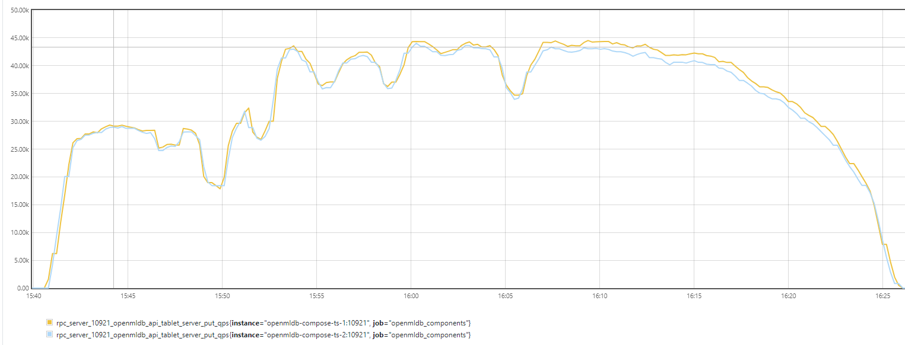
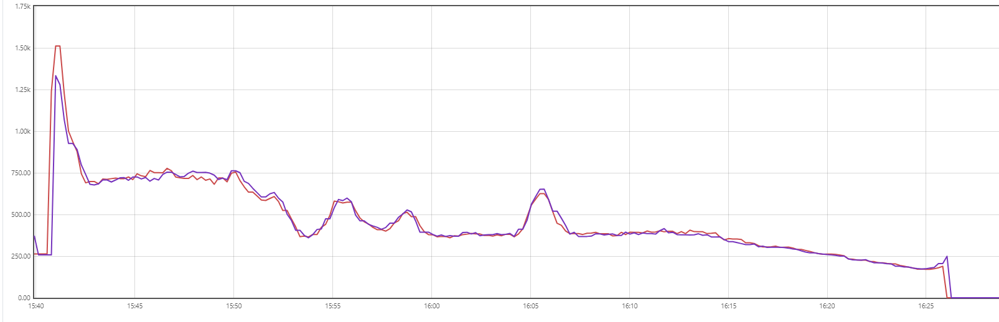
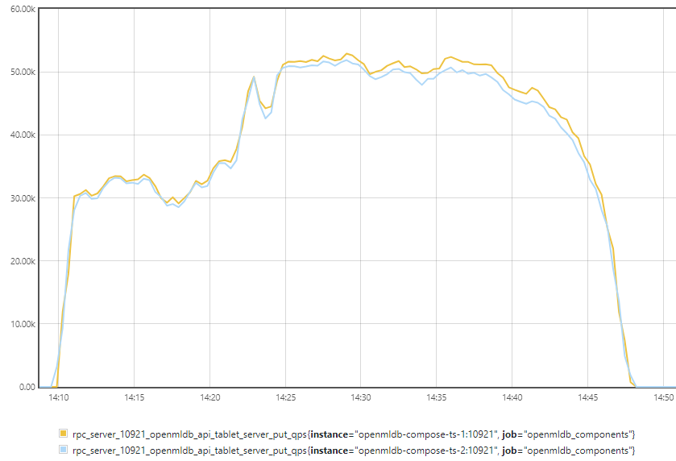
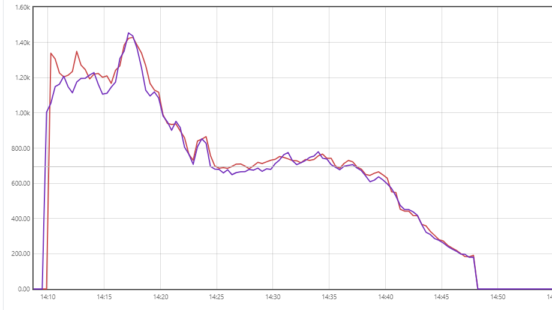

# OpenMLDB Cluster

OpenMLDB with all components and hdfs service.

## Cmds

Choose services with profile. Use env in `.env`.

```bash
docker-compose build <service> # build image if you modify Dockerfile
COMPOSE_PROFILES=hadoop,hive,rest docker-compose2 down -v --remove-orphans
COMPOSE_PROFILES=hadoop,hive,rest docker-compose2 up -d
COMPOSE_PROFILES=monitor docker-compose2 up -d
# start all services, but some profiles may need preparation.
COMPOSE_PROFILES=all docker-compose2 up -d

# cleanup hive parts
docker-compose2 down postgres metastore hiveserver2 -v && \
docker exec -it deploy-node hadoop fs -fs hdfs://namenode:9000 -rm -r -f /user/hive/ /user/iceberg/ && \
COMPOSE_PROFILES=hadoop,hive,rest docker-compose2 up -d
```

cleanup storage:

```bash
docker volume ls | grep openmldb-compose | awk '{print$2}' | xargs docker volume rm
```

Legacy compose files `xx-compose.yml` are not used, but you can use them to start single service.

## Configuration

`DEPLOY_NODE_IMAGE`: deploy-node image, usually update the version. You can use your own image, but it should have the same toolchain as the official image.

`HIVE_VERSION`: the image of hive service and the client in deploy-node.

If you want to test your own released package, set `RELEASE_MOUNT_SRC` and `RELEASE_MOUNT_DST`(==`/work/openmldb`) in `.env`.

If you want to mount other dir, set `EXTERNAL_MOUNT` in `.env`. For exmaple, if you want to test python sdk(src, not the whl package), ref <https://openmldb.ai/docs/zh/main/developer/python_dev.html>, you can set `EXTERNAL_MOUNT` to your python sdk dir, then `cd /work/ext/` to run pytest.

## Compose

You can do anything in deploy-node. In deploy-node, run hadoop or beeline, no need for conf in `$HADOOP_HOME` or `$HIVE_HOME`.

`docker-compose2 ps`

### Hadoop

In HADOOP profile parts(or you can check `hadoop-compose.yml`), I use image `bde2020/hadoop...`, not offical image, can't update hadoop version easily. But we don't need to change it frequently. Hive 4.0.0 can use hadoop 3.3.6.

Hadoop is simple, so you can access it just by url, like `hdfs://namenode:9000/`. Spark can access it without any hadoop config, just needs url(see `deploy-node/taskmanager.properties.template`).

You can use `hadoop fs -fs hdfs://namenode:9000 ...` to debug on hdfs, or use help func `hdfs`. You can prepare all data files in `test/data`, and `bash /work/test/hdfs.sh` to upload all to `hdfs://../user/test`.

### Hive

Can't use <https://github.com/apache/hive/blob/master/packaging/src/docker/docker-compose.yml> directly, cuz we need to a public hive service. So I want to set warehouse to hdfs path(not local path), and use postgres.
But hive will use `- warehouse:/opt/hive/data/warehouse` to store table, and can't read hive-site.xml in `HIVE_CUSTOM_CONF_DIR`. So I replace `hive-site.xml`, add `core-site.xml` and postgre jar.

Create hive env only: `COMPOSE_PROFILES=hadoop,hive docker-compose2 up -d`.

Debug postegre: `docker exec -it postgres psql metastore_db -U hive`.

Debug hive: `docker exec -it hiveserver2 beeline -u 'jdbc:hive2://hiveserver2:10000/'`.

If you use beeline, just need the url and the executable: `beeline -u jdbc:hive2://hiveserver2:10000/`. No extra conf(hive-site.xml or else) is needed. Service `hiveserver2` will help us, so `hiveserver2` needs full configs.

`spark-shell` will try to use hive to be built-in catalog, if has hive dependencies, even no hive conf, see **the logic in `org.apache.spark.repl.Main.createSparkSession()`**. In spark-shell, you can see `INFO Main: Created Spark session with Hive support` by default.

And `spark-sql` can't disable hive catalog by config `spark.sql.catalogImplementation=in-memory`, it always loads hive as built-in catalog. Ridiculous! So we can't use `spark-sql` to check about hive. It will mislead us.

Pyspark and `spark-submit` will use in-memory catalog by default.** But OpenMLDB TaskManager will add config `spark.sql.catalogImplementation=hive` for OpenMLDB offline job when submit job, if we have `enable.hive.support`(default is true). So I set `enable.hive.support=false` in `deploy-node/taskmanager.properties.template`, I can set what I want in Spark `--conf` or OpenMLDB `--spark_conf`. More clear.

Spark 3.2.1 use Hive metastore >=2.3.9 by default. Generally speaking, we can read Hive >= 2.3.9. So hive-4.0.0-beta-1 metastore service can be used. And it has iceberg depends, we can use iceberg in hive directly.

TODO: spark > 2.3 can read/write acid Hive table? <https://issues.apache.org/jira/browse/SPARK-15348>. But as I tested, ospark 3.2.1 can't read acid table.

### Offline test methods

As I said above, `spark-shell` and `spark-job` have some disadvantages. Use Pyspark or submit spark job directly. Pyspark 3.2.1 is old, doesn't support some useful features. Submitting job is more complex, you need to package your code and submit it, but it's the freest way to debug.

Pyspark sample: `python3 /work/test/pyspark.py`.

Offline job way:

- sql through TaskManager: only select
- submit batchjob can support full spark sql, but just one sql
  - `$SPARK_HOME/bin/spark-submit --master local --class com._4paradigm.openmldb.batchjob.RunBatchAndShow --properties-file /work/test/sparksql.ini /work/openmldb/taskmanager/lib/openmldb-batchjob-*.jar "<sql>"`
- submit app, you can write code to debug, but you need to package your code and submit it.

Some tips:

```bash
$SPARK_HOME/bin/spark-submit --master local --class com._4paradigm.openmldb.batchjob.RunBatchAndShow --properties-file /work/test/sparksql.ini /work/openmldb/taskmanager/lib/openmldb-batchjob-*.jar "SHOW NAMESPACES FROM hive_prod;" # error if no hive_prod config of iceberg
$SPARK_HOME/bin/spark-submit --master local --class com._4paradigm.openmldb.batchjob.RunBatchAndShow --properties-file /work/test/sparksql.ini /work/openmldb/taskmanager/lib/openmldb-batchjob-*.jar "SHOW NAMESPACES;" # no hive databases if just hive_prod, cuz spark catalog is in-memory(not hive catalog)
```

Spark v3.5.0:

```bash
cd /work/test
# curl -SLO https://dlcdn.apache.org/spark/spark-3.5.0/spark-3.5.0-bin-hadoop3.tgz
wget https://mirror.sjtu.edu.cn/apache/spark/spark-3.5.0/spark-3.5.0-bin-hadoop3.tgz
export SPARK_HOME=/work/test/spark-3.5.0-bin-hadoop3
```

If you want to write code to debug, one sql is not enough, use application way. But you need to package your code and submit it.

Java and scala cvt troubles in java test app, better to use scala. But sbt network is disgusting too. Decide by yourself. sbt scala is more helpful.

```bash
# in host, not deploy-node
sbt package
mvn package
# in deploy-node
$SPARK_HOME/bin/spark-submit --class "SimpleApp" \
  --master local[4] \
  -c spark.openmldb.sparksql=true \
  /work/test/java/target/simple-project-1.0.jar

$SPARK_HOME/bin/spark-submit --class "SimpleApp" \
  --master local[4] \
  -c spark.openmldb.sparksql=true \
  /work/test/scala/target/scala-2.12/simple-project_2.12-1.0.jar
```

### Hive Self Build(backup)

I tried <https://github.com/big-data-europe/docker-hive>, but only hive3 in <https://github.com/big-data-europe/docker-hive/pull/56/files#> and no iceberg support, I want hive 4.0.0. So build hive docker image by myself. see [Dockerfile](hive/Dockerfile).

```bash
https://dlcdn.apache.org/hadoop/common/hadoop-3.3.6/hadoop-3.3.6.tar.gz
https://dlcdn.apache.org/hive/hive-4.0.0-beta-1/apache-hive-4.0.0-beta-1-bin.tar.gz
```

Mainland can use url `https://mirror.sjtu.edu.cn/apache/...`.

Hive uses Hadoop, so you must have Hadoop in your path(client side, connect to hdfs cluster), and then install hive.

```bash
export JAVA_HOME=/usr/lib/jvm/java-1.8.0-openjdk-1.8.0.242.b08-0.el7_7.x86_64/jre
export HADOOP_HOME=$(pwd)/hadoop-3.3.6
export HADOOP_CONF_DIR=$HADOOP_HOME/etc/hadoop
export HIVE_HOME=$(pwd)/apache-hive-4.0.0-beta-1-bin

cp core-site.xml $HADOOP_HOME/etc/hadoop
# /user/hive/warehouse (aka hive.metastore.warehouse.dir default value) 
$HADOOP_HOME/bin/hadoop fs -fs hdfs://localhost:19000 -mkdir       /tmp
$HADOOP_HOME/bin/hadoop fs -fs hdfs://localhost:19000 -mkdir -p      /user/hive/warehouse
$HADOOP_HOME/bin/hadoop fs -fs hdfs://localhost:19000 -chmod g+w   /tmp
$HADOOP_HOME/bin/hadoop fs -fs hdfs://localhost:19000 -chmod g+w   /user/hive/warehouse
```

Derby sucks, so use postgres for cluster. Postgres image is enough.

Hive by default gets its configuration from `<install-dir>/conf/hive-default.xml`, the location of the Hive configuration directory can be changed by setting the `HIVE_CONF_DIR` environment variable. Configuration variables can be changed by (re-)defining them in `<install-dir>/conf/hive-site.xml`.

So we just config `hive-site.xml`.

```bash
cp hive-site.xml $HIVE_HOME/conf
$HIVE_HOME/bin/schematool -dbType postgres -initSchema --verbose
$HIVE_HOME/bin/hive --service metastore &
# hiveserver2 just for test, don't make it as a service
$HIVE_HOME/bin/hiveserver2 & # server
$HIVE_HOME/bin/beeline -u jdbc:hive2:// # cli on server
$HIVE_HOME/bin/beeline -u jdbc:hive2://metastore:10000 # cli on client
# in beeline or hive cli
show databases; # one `default` db
```

## Debug Tips

### Some cmds

If you want to do some simple test:

```bash
$SPARK_HOME/bin/spark-sql -c spark.openmldb.sparksql=true
```

### hive in Spark log

To debug OpenMLDB offline jobs, we check the offline job log.

When `enable.hive.support=false`, run `/work/openmldb/sbin/openmldb-cli.sh --spark_conf=/work/test/sparksql.ini < test/spark_test.sql``, in OpenMLDB offline job log, you can see:

```log
24/02/04 06:07:09 INFO SharedState: spark.sql.warehouse.dir is not set, but hive.metastore.warehouse.dir is set. Setting spark.sql.warehouse.dir to the value of hive.metastore.warehouse.dir.
24/02/04 06:07:10 INFO SharedState: Warehouse path is 'hdfs://namenode:9000/user/hive/warehouse'.
```

No Hive related logs above. When `enable.hive.support=true`, it'll be:

```log
24/02/04 06:18:19 INFO SharedState: spark.sql.warehouse.dir is not set, but hive.metastore.warehouse.dir is set. Setting spark.sql.warehouse.dir to the value of hive.metastore.warehouse.dir.
24/02/04 06:18:20 INFO SharedState: Warehouse path is 'hdfs://namenode:9000/user/hive/warehouse'.
...
24/02/04 06:18:28 INFO HiveConf: Found configuration file file:/work/openmldb/spark/conf/hive-site.xml
24/02/04 06:18:28 INFO HiveUtils: Initializing HiveMetastoreConnection version 2.3.9 using Spark classes.
24/02/04 06:18:29 INFO HiveClientImpl: Warehouse location for Hive client (version 2.3.9) is hdfs://namenode:9000/user/hive/warehouse
24/02/04 06:18:29 WARN HiveConf: HiveConf of name hive.stats.jdbc.timeout does not exist
24/02/04 06:18:29 WARN HiveConf: HiveConf of name hive.stats.retries.wait does not exist
24/02/04 06:18:29 INFO HiveMetaStore: 0: Opening raw store with implementation class:org.apache.hadoop.hive.metastore.ObjectStore
```

**We need more than a metastore uri to use spark read/write hive.** Spark needs postgresql configs and maybe more. For simplicity, I copy `hive-site.xml` to spark conf dir, so that Spark on deploy-node and taskmanager containers(deploy spark will copy the conf) can read the conf.

And you should check keyword `HiveConf` in log to know if session use hive as built-in catalog.

## Test

### Basic Test

After docker-compose up, you should do basic test, to make sure all services are ok.

Full script:

```bash
bash test/basic_test.sh
```

Details:

- test hdfs:

```bash
echo 'sc.parallelize(List( (1,"a"), (2,"b") )).toDF("key","value").write.mode("overwrite").option("header", "true").csv("hdfs://namenode:9000/tmp/shell-out")' | $SPARK_HOME/bin/spark-shell
```

then you can read:

```bash
echo 'spark.read.option("header", "true").csv("hdfs://namenode:9000/tmp/shell-out").show()' | $SPARK_HOME/bin/spark-shell
```

Hdfs is simple, I haven't met any problems.

- Check zk:

```bash
echo stat | nc openmldb-compose-zk-1 2181
```

- Check OpenMLDB cluster by openmldb_tool.

- Test OpenMLDB <-> Hadoop:

```bash
/work/openmldb/sbin/openmldb-cli.sh < test/hadoop.sql
```

You can check it on hdfs: `echo 'spark.read.option("header", "true").csv("hdfs://namenode:9000/tmp/openmldb-out").show()' | $SPARK_HOME/bin/spark-shell`

- Test OpenMLDB <-> Hive:

OpenMLDB Spark doesn't have pyspark env, I have installed pyspark in deploy-node. But pyspark 3.2.1 has some limitations.

OpenMLDB Spark to hive needs hive conf, it use metastore, not hiveserver2 jdbc. You can get hive metadata by just run `spark-shell/spark-sql` with metastore uri arg. `spark.hadoop.hive.metastore.uris` and `spark.hive.metastore.uris` both work. `spark.hadoop.hive.metastore.uris` is recommended?

Only have uris now, just see metadata, select(even no postgresql jar), but can't create table. If you want, you needs to config warehouse and more(just metastore.uris and warehouse can't work). For simplicity, **I use hive-site.xml**. Any job can start without hive conf options, log shows it loads hive-site.xml in `$HIVE_HOME/conf`. But if `spark.sql.catalogImplementation=in-memory`, it won't have `HiveConf` log.

**You can't create hive table with remote location in spark sql, `USING hive` only creates table in local warehouse(`pwd`/spark-warehouse). Use dataframe save to create, or create in hive client.**

So when we have hive-site.xml and postgresql jar in Spark conf, we can read and write hive by set `spark.sql.catalogImplementation`. If we don't want hive session catalog to be built-in catalog, we can set `spark.sql.catalogImplementation=in-memory` to use in-memory catalog to make it clear.

Create multi tables in hive by beeline, and read/write in OpenMLDB:

```bash
beeline -u jdbc:hive2://hiveserver2:10000 -e '!run /work/test/hive_setup.hql'
/work/openmldb/sbin/openmldb-cli.sh --interactive=false --spark_conf /work/test/bultiin-hive.ini < test/hive.sql
/work/openmldb/sbin/openmldb-cli.sh --interactive=false --spark_conf /work/test/bultiin-hive.ini < test/hive_acid.sql
```

- Note, I create non-acid table `test`(external tables), acid tables(full acid and insert-only, all managed tables). As I know, hive can't create a managed table without transactional.

`test/hive.sql` will load from hive, and write to hive, check hive table `basic_test.openmldb_write` by `beeline -u jdbc:hive2://hiveserver2:10000 -e "select * from basic_test.openmldb_write;"`

And hive table location should be `hdfs://namenode:9000/user/hive/warehouse`. (hive image hive-site.xml is `/opt/hive/data/warehouse`, I bind the conf with my hive-site.xml.)

`hive_acid.sql` will fail, select will be empty, ignore it.

### Iceberg Test

Test needs spark iceberg jars and spark configs. Official doc is <https://iceberg.apache.org/spark-quickstart/>. If version < 0.8.5. download jars from <https://iceberg.apache.org/releases/>. And need iceberg-hive-runtime <https://iceberg.apache.org/docs/latest/hive/> to use iceberg hive catalog, download iceberg-hive-runtime.

```bash
wget https://search.maven.org/remotecontent?filepath=org/apache/iceberg/iceberg-spark-runtime-3.2_2.12/1.4.3/iceberg-spark-runtime-3.2_2.12-1.4.3.jar
wget https://repo1.maven.org/maven2/org/apache/iceberg/iceberg-hive-runtime/1.4.3/iceberg-hive-runtime-1.4.3.jar
```

If download slowly, download them from <https://developer.aliyun.com/mvn/search>.

`cp iceberg-hive-runtime-1.4.2.jar $SPARK_HOME/jars` or add conf `spark.jars.packages=org.apache.iceberg:iceberg-spark-runtime-3.2_2.12:1.4.3;org.apache.iceberg:iceberg-hive-runtime:1.4.3`.

We set `enable.hive.support=false` in taskmanager to avoid interference, make TaskManager and manual submit to use the same spark conf. Switch mode by spark conf `spark.sql.catalogImplementation`.

#### Hive Catalog

Cleanup only hive part see [cmds](#cmds).

- Step 1: setup

```bash
hdfs -mkdir -p /user/hive/external_warehouse # store iceberg metadata
hdfs -mkdir -p /user/hive/iceberg_storage # store iceberg data
# hdfs -rm -r "/user/hive/iceberg_storage/*" "/user/hive/external_warehouse*"
```

Spark and Hive both can create iceberg tables in hive catalog. To make sure that OpenMLDB can create iceberg table, we use Spark to create.

Spark jar is hive-metastore-2.3.9.jar, compatible with hive 4.0.0-beta-1 metastore service.

An external table's location should not be located within managed warehouse root directory of its database, iceberg table should be external table and store in `metastore.warehouse.external.dir`(hive-site.xml config), don't use the same path with `metastore.warehouse.dir`(default is `/user/hive/warehouse`) as iceberg table location. And must set `spark.sql.catalog.hive_prod.warehouse=../user/hive/iceberg_storage` to store iceberg table metadata.

Iceberg config are in `test/ice_hive.ini`. We don't need to worry about spark-sql loads hive as built-in catalog, cuz we use `hive_prod` catalog to access iceberg hive catalog.

Create table ref <https://iceberg.apache.org/docs/latest/getting-started/#creating-a-table>.

```bash
$SPARK_HOME/bin/spark-sql --properties-file=/work/test/ice_hive.ini -c spark.openmldb.sparksql=true < /work/test/ice_hive_setup.sql
```

No need to create taxis_out, openmldb select out can create table. Setup will create a new table `nyc.taxis`(drop if exists before), desc:

```sql
spark-sql> desc formatted hive_prod.nyc.taxis;
vendor_id               bigint
trip_id                 bigint
trip_distance           float
fare_amount             double
store_and_fwd_flag      string

# Partitioning
Part 0                  vendor_id

# Metadata Columns
_spec_id                int
_partition              struct<vendor_id:bigint>
_file                   string
_pos                    bigint
_deleted                boolean

# Detailed Table Information
Name                    hive_prod.nyc.taxis
Location                hdfs://namenode:9000/user/hive/iceberg_storage/nyc.db/taxis
Provider                iceberg
Owner                   root
Table Properties        [current-snapshot-id=3548183950635063752,format=iceberg/parquet,format-version=2,write.parquet.compression-codec=zstd]
Time taken: 0.041 seconds, Fetched 22 row(s)
```

Location should be `Location                hdfs://namenode:9000/user/hive/iceberg_storage/nyc.db/taxis`.

- Step 2: test OpenMLDB

test OpenMLDB <-> iceberg(hive catalog): `test/iceberg-hive.sql`

```bash
/work/openmldb/sbin/openmldb-cli.sh --interactive=false --spark_conf /work/test/ice_hive.ini < /work/test/ice_hive_test.sql
```

- Step 3: validate

OpenMLDB can read/write iceberg table, we can check the table location and read them by spark.

```sql
DESC FORMATTED hive_prod.nyc.taxis;
SELECT * FROM hive_prod.nyc.taxis;
DESC FORMATTED hive_prod.nyc.taxis_out;
SELECT * FROM hive_prod.nyc.taxis_out;
```

You can see taxis_out has data, just 2 rows(in test, we just write vendor_id=1 to taxis_out).

And Hive can read them too, EXTERNAL_TABLE with table_type ICEBERG. But before Hive read, Spark should `ALTER TABLE hive_prod.nyc.taxis SET TBLPROPERTIES ('engine.hive.enabled'='true');`, ref <https://github.com/apache/iceberg/issues/1883>.(I don't know why no effect if set in Hive, should use Spark to set)

#### Hadoop Catalog

test/ice_hadoop.ini, hadoop catalog dir is `hdfs://namenode:9000/user/iceberg/hadoop/`.

- Step 1: create iceberg table by spark

```bash
source /work/test/funcs.sh
hdfs -mkdir -p /user/iceberg/hadoop
# hdfs -rm -r "/user/hadoop_iceberg/*" # rm if needs
$SPARK_HOME/bin/spark-sql --properties-file=/work/test/ice_hadoop.ini -c spark.openmldb.sparksql=true < /work/test/ice_hadoop_setup.sql
# SHOW NAMESPACES FROM hadoop_prod; -- can know prod namespace(database)
```

- Step 2: test

```bash
/work/openmldb/sbin/openmldb-cli.sh --interactive=false --spark_conf /work/test/ice_hadoop.ini < test/ice_hadoop_test.sql
```

- Step 3: validate

You can check it on hdfs: `hdfs -ls /user/iceberg/hadoop/nyc/`, or use Spark to read iceberg tables.

#### Rest Catalog

Rest catalog service can't use the docker image iceberg-rest, cuz it needs hive patch, merge <https://github.com/tabular-io/iceberg-rest-image> and hive support <https://github.com/tabular-io/iceberg-rest-image/pull/43>. And it may fail when build iceberg-rest image based on zulu-openjdk:17 and special network, so I change the image and gradle mirrors.

And I use the hive catalog in previous chapter, so run hive catalog setup. Test will use rest catalog, conf in `test/ice_rest.ini`.

```bash
# add rest service
docker-compose2 --env-file compose.env -f hadoop-compose.yml -f hive-compose.yml -f compose.yml -f ice-rest.yml up -d
```

```bash
$SPARK_HOME/bin/spark-sql --properties-file=/work/test/ice_hive.ini -c spark.openmldb.sparksql=true < /work/test/ice_hive_setup.sql
/work/openmldb/sbin/openmldb-cli.sh --interactive=false --spark_conf /work/test/ice_rest.ini < /work/test/ice_rest_test.sql
```

#### Session Catalog

Session catalog is used for merge. If we use hive_prod, you can get db in hive, but **no hive tables**, only iceberg tables. Let's test it, and we use submit to make sure the offline job can read.

```bash
# hive catalog setup
$SPARK_HOME/bin/spark-sql --properties-file=/work/test/ice_hive.ini -c spark.openmldb.sparksql=true < /work/test/ice_hive_setup.sql
# hive table setup
beeline -u jdbc:hive2://hiveserver2:10000 -e '!run /work/test/hive_setup.hql'
# here, we have basic_test db with hive tables(managed or external), and nyc db with iceberg tables

# select iceberg tables
$SPARK_HOME/bin/spark-submit --master local --class com._4paradigm.openmldb.batchjob.RunBatchAndShow --properties-file /work/test/ice_hive.ini -c spark.openmldb.sparksql=true /work/openmldb/taskmanager/lib/openmldb-batchjob-*.jar "SHOW TABLES FROM hive_prod.nyc;"
# can't select any table which not in iceberg format
$SPARK_HOME/bin/spark-submit --master local --class com._4paradigm.openmldb.batchjob.RunBatchAndShow --properties-file /work/test/ice_hive.ini -c spark.openmldb.sparksql=true /work/openmldb/taskmanager/lib/openmldb-batchjob-*.jar "SHOW TABLES FROM hive_prod.basic_test;"
```

And if set `spark.sql.catalogImplementation=hive`, we can get all metadata in hive. But if **select the iceberg table in hive built-in catalog**, got error `Caused by: java.lang.InstantiationException`.

```bash
# select iceberg tables
$SPARK_HOME/bin/spark-submit --master local --class com._4paradigm.openmldb.batchjob.RunBatchAndShow -c spark.openmldb.sparksql=true -c spark.sql.catalogImplementation=hive /work/openmldb/taskmanager/lib/openmldb-batchjob-*.jar "SHOW TABLES FROM nyc;"
# exception java.lang.RuntimeException: java.lang.InstantiationException
$SPARK_HOME/bin/spark-submit --master local --class com._4paradigm.openmldb.batchjob.RunBatchAndShow -c spark.openmldb.sparksql=true -c spark.sql.catalogImplementation=hive /work/openmldb/taskmanager/lib/openmldb-batchjob-*.jar "SELECT * FROM nyc.taxis;"
```

So we need to use SparkSessionCatalog, to make all tables in one catalog.  We can read iceberg tables and hive tables in one catalog.

SparkSessionCatalog must be spark_catalog, can't choose other names. Spark 3.2.1 and 3.5.0 both work.

```bash
# read iceberg table succeed
$SPARK_HOME/bin/spark-submit --master local --class com._4paradigm.openmldb.batchjob.RunBatchAndShow --properties-file /work/test/ice_hive_session.ini -c spark.openmldb.sparksql=true /work/openmldb/taskmanager/lib/openmldb-batchjob-*.jar "SELECT * FROM nyc.taxis;"
# read hive table succeed(cuz `spark.sql.catalogImplementation=hive`)
$SPARK_HOME/bin/spark-submit --master local --class com._4paradigm.openmldb.batchjob.RunBatchAndShow --properties-file /work/test/ice_hive_session.ini -c spark.openmldb.sparksql=true /work/openmldb/taskmanager/lib/openmldb-batchjob-*.jar "SELECT * FROM basic_test.test;"
```

## Hive ACID Issues TODO

`test/create_like_hive_acid.sql`

We may get empty when selecting hive acid table.

The bug we met when spark read hive acid(select * from acid_table) before:

```log
MetaException(message:Your client does not appear to support insert-only tables. To skip capability checks, please set metastore.client.capability.check to false. This setting can be set globally, or on the client for the current metastore session. Note that this may lead to incorrect results, data loss, undefined behavior, etc. if your client is actually incompatible. You can also specify custom client capabilities via get_table_req API.)   Description  The server encountered an unexpected condition that prevented it from fulfilling the request.   Exception   javax.servlet.ServletException: javax.servlet.ServletException: MetaException(message:Your client does not appear to support insert-only tables. To skip capability checks, please set metastore.client.capability.check to false. This setting can be set globally, or on the client for the current metastore session. Note that this may lead to incorrect results, data loss, undefined behavior, etc. if your client is actually incompatible. You can also specify custom client capabilities via get_table_req API.) (libchurl.c:935)  (seg36 slice1 172.16.10.26:4000 pid=93248) (libchurl.c:935)
```

<https://issues.apache.org/jira/browse/SPARK-15348> shows:

- `hive.strict.managed.tables` is true, so if it's false, spark may read acid table?
- Spark ACID project, but it's too old now(2019)

spark 3.2.1 + hive 3.1.2, acid works? iceberg hive catalog works? session catalog works?
Hive 3 dose not support java 11, needs java 8

check about spark with hive3.1.2 dependency:

openmldb/spark/bin/spark-sql -c spark.openmldb.sparksql=true -c spark.sql.hive.metastore.version=3.1.2 -c spark.sql.hive.metastore.jars=maven

empty too

openmldb/spark/bin/spark-sql -c spark.openmldb.sparksql=true -c spark.sql.hive.metastore.version=3.1.2 -c spark.sql.hive.metastore.jars=maven -c spark.sql.warehouse.dir=hdfs://namenode:19000/user/hive/warehouse

failed too

spark-3.5.0 bin/spark-sql -c spark.hadoop.hive.metastore.uris=thrift://hive-metastore:9083 other configs in spark/conf/hive-site.xml and core-site.xml
select * from db.hive_insert_only_parquet;
error: MetaException(message:Your client does not appear to support insert-only tables. To skip capability checks, please set metastore.client.capability.check to false. This setting can be set globally, or on the client for the current metastore session. Note that this may lead to incorrect results, data loss, undefined behavior, etc. if your client is actually incompatible. You can also specify custom client capabilities via get_table_req API.)

spark/jars:
-rw-r--r-- 1 huangwei staff  559K Jan 29 22:28 spark-hive-thriftserver_2.12-3.5.0.jar
-rw-r--r-- 1 huangwei staff  708K Jan 29 22:28 spark-hive_2.12-3.5.0.jar
-rw-r--r-- 1 huangwei staff  7.9M Jan 29 22:28 hive-metastore-2.3.9.jar
so still 2.3.9.

spark 3.5.0 can set to 3.1.3, spark 3.2.1 set to 3.1.2 <https://spark.apache.org/docs/3.5.0/sql-data-sources-hive-tables.html#interacting-with-different-versions-of-hive-metastore>

bin/spark-sql -c spark.openmldb.sparksql=true -c spark.sql.hive.metastore.version=3.1.3 -c spark.sql.hive.metastore.jars=maven -c spark.sql.warehouse.dir=hdfs://namenode:19000/user/hive/warehouse -c spark.hadoop.hive.metastore.uris=thrift://hive-metastore:9083

spark-acid test:
current is 0.6.0, but haven't upload to public repo. and scala is 2.11, just test 0.4.0, upgrade later.
load hive bulti-in catalog automatically
./spark-shell --packages qubole:spark-acid:0.4.0-s_2.11 -c spark.openmldb.sparksql=true
failed

may need to build spark-acid, even latest version 0.6.0 is 2020, too old?

hive beeline can read, but spark can't read table(empty but exists).

spark desc table:

```sql
key                     int
value                   string

# Detailed Table Information
Database                basic_test
Table                   acid
Owner                   hive
Created Time            Wed Feb 21 09:17:39 UTC 2024
Last Access             UNKNOWN
Created By              Spark 2.2 or prior
Type                    MANAGED
Provider                hive
Table Properties        [bucketing_version=2, numFilesErasureCoded=0, transactional=true, transactional_properties=default, transient_lastDdlTime=1708507064]
Statistics              718 bytes, 3 rows
Location                hdfs://namenode:9000/user/hive/warehouse/basic_test.db/acid
Serde Library           org.apache.hadoop.hive.ql.io.orc.OrcSerde
InputFormat             org.apache.hadoop.hive.ql.io.orc.OrcInputFormat
OutputFormat            org.apache.hadoop.hive.ql.io.orc.OrcOutputFormat
Storage Properties      [serialization.format=1]
Partition Provider      Catalog
```

try compaction delta files, but table compaction is async op `alter table basic_test.acid COMPACT 'major';`, `SHOW COMPACTIONS;` in beeline shows. And stuck on initiated state.

try use jdbc:
don't forget hive catalog.
`$SPARK_HOME/bin/spark-submit --class "SimpleApp"   --master local[4]   -c spark.openmldb.sparksql=true -c spark.sql.catalogImplementation=hive  /work/test/scala/target/scala-2.12/simple-project_2.12-1.0.jar`

Hive Warehouse Connector (HWC) securely accesses Hive-managed (ACID Tables) from Spark. You need to use HWC software to query Apache Hive-managed tables from Apache Spark.
Can use this one?
However, we anticipate that HWC for Spark 3 will be included in the upcoming CDS 3.3 release in CDP 7.1.8. <https://community.cloudera.com/t5/Support-Questions/Spark3-connection-to-HIVE-ACID-Tables/m-p/348833>

So try to read hive table by scala? not spark session.

## Kafka

```bash
cd kafka
# or cp your pacakage here
curl -SLO https://openmldb.ai/download/kafka-connector/kafka-connect-jdbc.tgz
tar zxf kafka-connect-jdbc.tgz
cd ..
docker-compose2 down kafka-zookeeper kafka kafka-connect -v
# COMPOSE_PROFILES=hadoop,kafka
COMPOSE_PROFILES=all docker-compose2 up -d
```

Then you can manage connector by rest api in any container. I add a performance test here for kafka connect, the performance will be better if you use a real kafka cluster, don't share hardware resources with OpenMLDB cluster, and more parrallelism.

- [ ] performance test, use talking data source, and java producer. Ref <https://github.com/4paradigm/OpenMLDB/blob/e8811278c293596bc3963c51bac2d47c45cd65a4/test/integration-test/openmldb-test-java/openmldb-ecosystem/src/test/resources/kafka_test_cases.yml>.
- [ ] Kafka connect image, ref <https://openmldb.ai/docs/zh/main/integration/online_datasources/kafka_connector_demo.html#kubernetes>

### Tips

Kafka depends on ZooKeeper, but it use the root dir `/`. If use OpenMLDB zookeeper, it's difficult to delete only kafka metadata. So I use another zookeeper service. You can recreate the whole Kafka cluster by remove kafka-zookeeper volume.

If zk has some legacy metadata, may cause `Timed out while waiting to get end offsets for topic 'connect-offsets' on brokers at kafka:9092`.

### Performance Test

You can check `curl http://kafka-connect:8083/connectors/schema-connector/status` to know the status of the connector. But the connector write concurrency is not related to the number of connector tasks. If the topic is 1 partition, only 1 task runs. So I'll set the topic partition and task number to the same.

#### Test in one

OpenMLDB: 2 tablet servers(24 threads per server), table only one time index, replica 2 partition 8.

Kafka: 1 broker, 1 zookeeper, 1 connect.

Src: `python3 spark_kafka.py`, 16 threads write `train.csv` to kafka, write to kafka is fast ~10min. But it'll race with `Kafka -> OpenMLDB`, the write qps in OpenMLDB will be 10min low and then higher.

I don't record the max latency, it's usually in the first 10min, not the stable period.

- topic 1 partition 1 replicator, connector 1 task

We can know the tablet work threads, ref brpc docs/cn/server_debugging.md. `bthread_worker_usage` just 1-2 in each tablet.

| total time  | qps/t | p99/t  |  p9999/t |  avg/t |  
|---|---|---|---|---|
| ~10h  | 2.5k | 0.2ms  | 3ms  | 0.09ms  |

(xx/t: per tablet server)

- topic 8 partition 1 replicator, connector 8 task

| total time  | qps/t | p99/t  |  p9999/t |  avg/t |  
|---|---|---|---|---|
| 110min  | 15k | 0.17ms  | 3.5ms  | 0.09ms  |

- topic 40 partition 1 replicator, connector 40 task

| total time  | qps/t | p99/t  |  p9999/t |  avg/t |  
|---|---|---|---|---|
| 45min  | 43k | 0.4ms | 4ms | 0.14ms |




- topic 64 partition 1 replicator, connector 64 task

| total time  | qps/t | p99/t  |  p9999/t |  avg/t |  
|---|---|---|---|---|
| 40min  | 50k | ~0.7ms  | 5ms  | 0.02ms  |




- more than 72

thread race and lock, qps <= 2.5k

> bthread_count: 同时存在的bthread个数
bthread_worker_count: bthread映射至的pthread的个数。
> <https://github.com/apache/brpc/issues/137#issuecomment-348849721>

If need kafka metrics, see <https://github.com/bitnami/charts/blob/main/bitnami/kafka/README.md>, enable metrics.

## Prometheus + Grafana

```bash
COMPOSE_PROFILES=monitor docker-compose2 up -d
# restart prometheus to clear old data
# but it won't clear metrics produced by servers(e.g. count metrics), be caution
COMPOSE_PROFILES=monitor docker-compose2 down prometheus -v
```

Prometheus addr `http://prometheus:9090`, web should use `http://prometheus:9093`. Grafana web use `http://<your machine ip>:3003`.

Update prometheus config by send `SIGHUP` to process, or sending a HTTP POST request to the /-/reload. Http is better.

```bash
curl -X POST http://prometheus:9090/-/reload
```

## Thanks

<https://github.com/adiii717/docker-container-ssh>

<https://github.com/big-data-europe/docker-hadoop/>

<https://github.com/tabular-io/iceberg-rest-image>

## TODO
